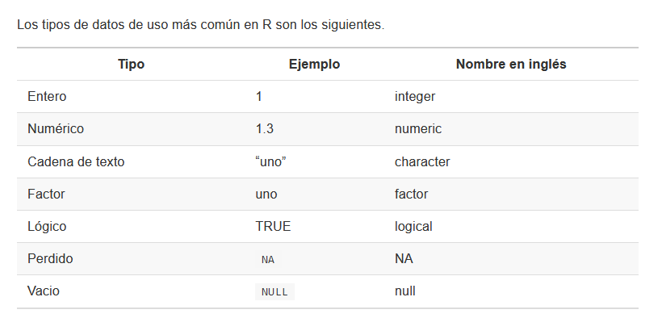
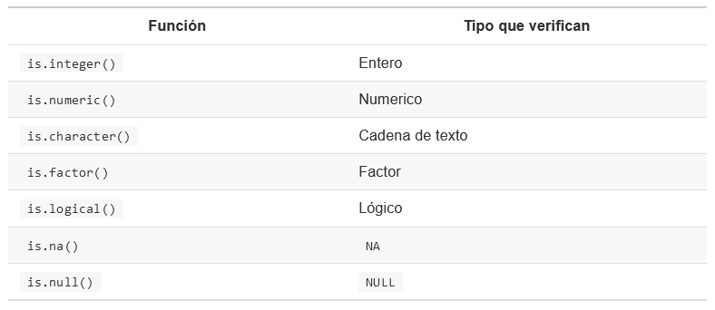

```{r echo=FALSE}
knitr::opts_chunk$set(fig.align = "center", out.width = "80%", echo = TRUE, message = FALSE, warning = FALSE)
```

```{r echo=FALSE}
#library(usethis)
#use_git()
#use_github()
#usethis::use_git_remote("origin", url = NULL, overwrite = TRUE)
```

# Repaso

```{r out.width="80%", fig.align='center', echo=FALSE}
library(knitr)

```

## Entero y numérico
**Enteros:** representan números sin una parte decimal o fraccionaria. Pueden ser usados en operaciones matemáticas.

**Numérico** representan números enteros que pueden incluir una parte decimal o fraccionaria

## Cadena de texto
**caracter** representa texto. En R este se encuentra entre comillas simples o dobles (Puede contener letras, números, espacios, signos de puntuación, símbolos especiales)

## Factor
Un dato representado por una etiqueta. Por ejemplo: los números 0 y 1 expresa hembra y macho en el sexado de especies. De esta manera reducimos el espacio de almacenamiento en nuestros datos.

## Lógico
Representan si una condición se cumple o no (TRUE y FALSE). Solo admite dos valores.

## NA y NULL
Se usa *NA* para representar datos perdidos mientras que *NULL* representa la ausencia de datos.

## Coerción
En R, los datos pueden ser coercionados, es decir, forzados, para transformarlos de un tipo a otro. Habrá ocasiones en que la operación ocurra sin problemas, y otras en las que falle y se obtenga un error. Esto ocurre debido a que existe una jerarquía:

- lógico

- entero

- numérico

- caracter


```{r}
x <- c(letters[1:10])
class(x)
as.numeric(x)

```

Las coerciones no pueden ocurrir en orden inverso.

```{r echo=FALSE}
include_graphics("figuras/coerción.PNG")
```

## Verificar un tipo de dato

Para este fin podemos usar la función class() de R.Esto es de utilidad para asegurarnos que las operaciones que deseamos realizar tendrán los datos apropiados para llevarse a cabo con éxito.

```{r}
class(3)
class(TRUE)
class("3")
```

También podemos verificar si un dato es de un tipo específicos con la familia de funciones is().

```{r echo=FALSE}

```

```{r}
is.numeric(3)
is.character("5")

```

# Operadores

Los operadores son los símbolos que le indican a R que debe realizar una tarea. Combinando datos y operadores logramos que R haga su trabajo.

- Aritméticos

- Relacionales 

- Lógicos

- De asignación

## Operadores aritméticos

Es usado para realizar operaciones aritméticos.

```{r echo=FALSE}
include_graphics("figuras/operadorAritmetico.PNG")
```

## Operadores relacionales

Son usado para hacer comparaciones y siempre devuelven como resultado *TRUE* y *FALSE*.

```{r echo=FALSE}
include_graphics("figuras/operadorRelacional.PNG")
```

## Operadores lógicos

Describen relaciones lógicas, expresadas como verdadero o falso.

```{r echo=FALSE}
include_graphics("figuras/operadorLogico.PNG")
```

Los operadores "|" y "&" siguen estas reglas:

- | devuelve TRUE si alguno de los datos es TRUE

- & solo devuelve TRUE si ambos datos son TRUE

- | solo devuelve FALSE si ambos datos son FALSE

- & devuelve FALSE si alguno de los datos es FALSE

# Estructura de datos

Las estructuras de datos son objetos que contienen datos. Tienen diferentes características entre ellas son: su número de **dimensiones** y si son **homogéneas** o **heterogénea**.

```{r echo=FALSE}
include_graphics("figuras/estructuraDatos.PNG")
```
```{r}
#VECTORES
#vector numérico
c(1,2,4,5,6)
#vector caracter
c("casa","persona","computador")
#vector lógico
c(TRUE, FALSE, TRUE, TRUE)
```

```{r}
#MATRICES - ARRAYS
matrix(1:12)
matrix(1:12, nrow = 3, ncol = 4)

```

Dos matrices A y B solo podrán ser multiplicadas si el número de columnas de la matriz A coincide con el número de filas de la matriz B. Por ejemplo:

```{r}
mi_matriz1 <- matrix(1:12, nrow = 4, ncol = 3)
mi_matriz2 <- matrix(1:30, nrow = 3, ncol = 10)
```

```{r}
#Multiplicación de matrices = Operados %*%
mi_matriz1 %*% mi_matriz2 

#Operador de división cuyo resultado es el residuo
5%%3
```

# Dataframe

Son estructuras de datos de dos dimensiones. Pueden contener datos de diferentes tipos o clases, por tanto son heterogéneas. Esta estructura es la más usada para realizar análisis de datos.


```{r}
desembarques <- read.csv("sample_landings_data_raw.csv")
head(desembarques, 4)
#renombrar variables
namesNew <- c("año", "fecha", "viaje_ID", "esfuerzo_hora", "aparejo", "especies", "tall_cm", "peso")
names(desembarques) <- namesNew

#agregar columnas
desembarques$id2 <- paste(desembarques$aparejo, desembarques$especies, sep="_")
head(desembarques, 4)

#valores perdidos
desembarques[!complete.cases(desembarques),]

#valores tipos
unique(desembarques$aparejo)
desembarques$aparejo <- tolower(desembarques$aparejo)

unique(desembarques$especies)
table(desembarques$especies == "Caesoi cunning")
table(desembarques$especies == "Caesio cuning")

desembarques[desembarques$especies == "Caesoi cunning",] 

#cambiando nombre variable
desembarques$especies[desembarques$especies == "Caesoi cunning"] <- "Caesio cuning"

#quitar valores perdidos
desembarques <- na.omit(desembarques)
```


