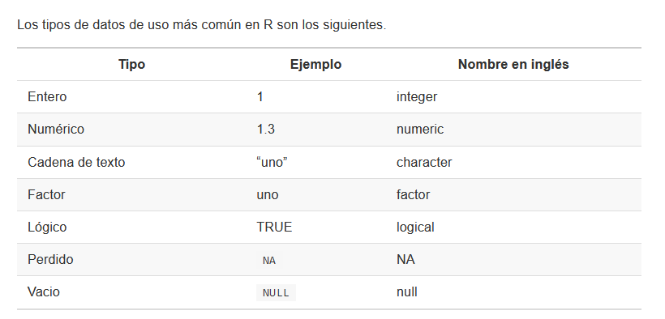
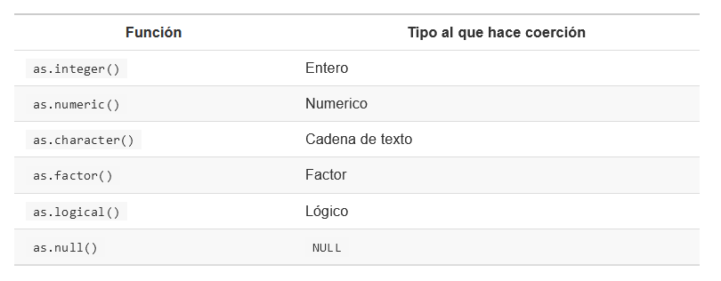
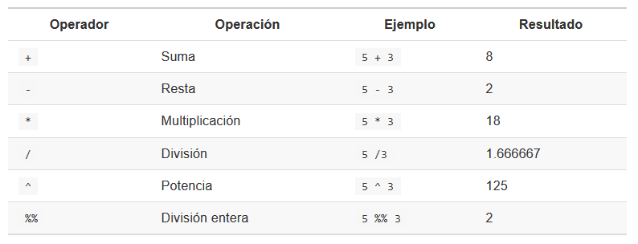
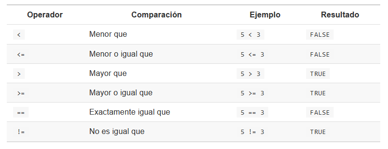
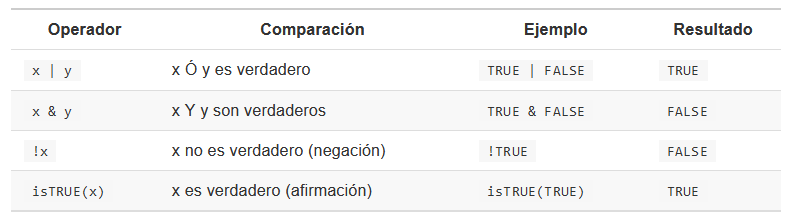
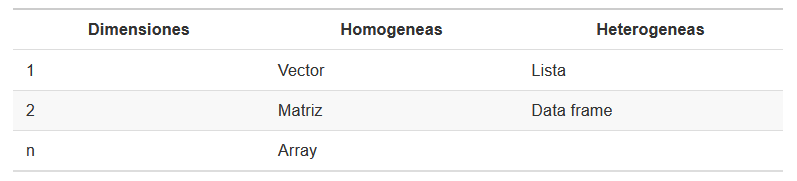

Semana 8
================

# Repaso



## Entero y numérico

**Enteros:** representan números sin una parte decimal o fraccionaria.
Pueden ser usados en operaciones matemáticas.

**Numérico** representan números enteros que pueden incluir una parte
decimal o fraccionaria

## Cadena de texto

**caracter** representa texto. En R este se encuentra entre comillas
simples o dobles (Puede contener letras, números, espacios, signos de
puntuación, símbolos especiales)

## Factor

Un dato representado por una etiqueta. Por ejemplo: los números 0 y 1
expresa hembra y macho en el sexado de especies. De esta manera
reducimos el espacio de almacenamiento en nuestros datos.

## Lógico

Representan si una condición se cumple o no (TRUE y FALSE). Solo admite
dos valores.

## NA y NULL

Se usa *NA* para representar datos perdidos mientras que *NULL*
representa la ausencia de datos.

## Coerción

En R, los datos pueden ser coercionados, es decir, forzados, para
transformarlos de un tipo a otro. Habrá ocasiones en que la operación
ocurra sin problemas, y otras en las que falle y se obtenga un error.
Esto ocurre debido a que existe una jerarquía:

-   lógico

-   entero

-   numérico

-   caracter

``` r
x <- c(letters[1:10])
class(x)
```

    ## [1] "character"

``` r
as.numeric(x)
```

    ##  [1] NA NA NA NA NA NA NA NA NA NA

Las coerciones no pueden ocurrir en orden inverso.



## Verificar un tipo de dato

Para este fin podemos usar la función class() de R. Esto es de utilidad
para asegurarnos que las operaciones que deseamos realizar tendrán los
datos apropiados para llevarse a cabo con éxito.

``` r
class(3)
```

    ## [1] "numeric"

``` r
class(TRUE)
```

    ## [1] "logical"

``` r
class("3")
```

    ## [1] "character"

También podemos verificar si un dato es de un tipo específicos con la
familia de funciones is().


``` r
is.numeric(3)
```

    ## [1] TRUE

``` r
is.character("5")
```

    ## [1] TRUE

# Operadores

Los operadores son los símbolos que le indican a R que debe realizar una
tarea. Combinando datos y operadores logramos que R haga su trabajo.

-   Aritméticos

-   Relacionales

-   Lógicos

-   De asignación

## Operadores aritméticos

Es usado para realizar operaciones aritméticos.



## Operadores relacionales

Son usado para hacer comparaciones y siempre devuelven como resultado
*TRUE* y *FALSE*.



## Operadores lógicos

Describen relaciones lógicas, expresadas como verdadero o falso.



Los operadores “\|” y “&” siguen estas reglas:

-   devuelve TRUE si alguno de los datos es TRUE

-   & solo devuelve TRUE si ambos datos son TRUE

-   solo devuelve FALSE si ambos datos son FALSE

-   & devuelve FALSE si alguno de los datos es FALSE

# Estructura de datos

Las estructuras de datos son objetos que contienen datos. Tienen
diferentes características entre ellas son: su número de **dimensiones**
y si son **homogéneas** o **heterogéneas**.



``` r
#VECTORES
#vector numérico
c(1,2,4,5,6)
```

    ## [1] 1 2 4 5 6

``` r
#vector caracter
c("casa","persona","computador")
```

    ## [1] "casa"       "persona"    "computador"

``` r
#vector lógico
c(TRUE, FALSE, TRUE, TRUE)
```

    ## [1]  TRUE FALSE  TRUE  TRUE

``` r
#MATRICES - ARRAYS
matrix(1:12)
```

    ##       [,1]
    ##  [1,]    1
    ##  [2,]    2
    ##  [3,]    3
    ##  [4,]    4
    ##  [5,]    5
    ##  [6,]    6
    ##  [7,]    7
    ##  [8,]    8
    ##  [9,]    9
    ## [10,]   10
    ## [11,]   11
    ## [12,]   12

``` r
matrix(1:12, nrow = 3, ncol = 4)
```

    ##      [,1] [,2] [,3] [,4]
    ## [1,]    1    4    7   10
    ## [2,]    2    5    8   11
    ## [3,]    3    6    9   12

Dos matrices A y B solo podrán ser multiplicadas si el número de
columnas de la matriz A coincide con el número de filas de la matriz B.
Por ejemplo:

``` r
mi_matriz1 <- matrix(1:12, nrow = 4, ncol = 3)
mi_matriz2 <- matrix(1:30, nrow = 3, ncol = 10)
```

``` r
#Multiplicación de matrices = Operados %*%
mi_matriz1 %*% mi_matriz2 
```

    ##      [,1] [,2] [,3] [,4] [,5] [,6] [,7] [,8] [,9] [,10]
    ## [1,]   38   83  128  173  218  263  308  353  398   443
    ## [2,]   44   98  152  206  260  314  368  422  476   530
    ## [3,]   50  113  176  239  302  365  428  491  554   617
    ## [4,]   56  128  200  272  344  416  488  560  632   704

``` r
#Operador de división cuyo resultado es el residuo
5%%3
```

    ## [1] 2

# Dataframe

Son estructuras de datos de dos dimensiones. Pueden contener datos de
diferentes tipos o clases, por tanto son heterogéneas. Esta estructura
es la más usada para realizar análisis de datos.

``` r
desembarques <- read.csv("sample_landings_data_raw.csv")
head(desembarques, 4)
```

    ##     yy     dat trip effort   gr             sp l_cm      w_cm
    ## 1 2003 4/30/03    1     10 Trap Caesoi cunning   36 1089.1402
    ## 2 2003 4/30/03    1     10 trap  Caesio cuning   29  565.3879
    ## 3 2003 4/30/03    1     10 Trap  Caesio cuning   34  915.8276
    ## 4 2003 4/30/03    1     10 Trap  Caesio cuning   36 1089.1402

``` r
#renombrar variables
namesNew <- c("año", "fecha", "viaje_ID", "esfuerzo_hora", "aparejo", "especies", "tall_cm", "peso")
names(desembarques) <- namesNew

#agregar columnas
desembarques$id2 <- paste(desembarques$aparejo, desembarques$especies, sep="_")
head(desembarques, 4)
```

    ##    año   fecha viaje_ID esfuerzo_hora aparejo       especies tall_cm      peso
    ## 1 2003 4/30/03        1            10    Trap Caesoi cunning      36 1089.1402
    ## 2 2003 4/30/03        1            10    trap  Caesio cuning      29  565.3879
    ## 3 2003 4/30/03        1            10    Trap  Caesio cuning      34  915.8276
    ## 4 2003 4/30/03        1            10    Trap  Caesio cuning      36 1089.1402
    ##                   id2
    ## 1 Trap_Caesoi cunning
    ## 2  trap_Caesio cuning
    ## 3  Trap_Caesio cuning
    ## 4  Trap_Caesio cuning

``` r
#valores perdidos
desembarques[!complete.cases(desembarques),]
```

    ##       año    fecha viaje_ID esfuerzo_hora  aparejo      especies tall_cm
    ## 28   2003   5/1/03       10            10 Handline Caesio cuning  19.000
    ## 1637 2004 12/18/04       NA             9     Trap Caesio cuning  20.104
    ##          peso                    id2
    ## 28         NA Handline_Caesio cuning
    ## 1637 186.1558     Trap_Caesio cuning

``` r
#valores tipos
unique(desembarques$aparejo)
```

    ## [1] "Trap"     "trap"     "Muroami"  ""         "Handline" "Gillnet"  "Trolling"
    ## [8] "Speargun"

``` r
desembarques$aparejo <- tolower(desembarques$aparejo)

unique(desembarques$especies)
```

    ## [1] "Caesoi cunning" "Caesio cuning"

``` r
table(desembarques$especies == "Caesoi cunning")
```

    ## 
    ## FALSE  TRUE 
    ##  7212     2

``` r
table(desembarques$especies == "Caesio cuning")
```

    ## 
    ## FALSE  TRUE 
    ##     2  7212

``` r
desembarques[desembarques$especies == "Caesoi cunning",] 
```

    ##    año   fecha viaje_ID esfuerzo_hora aparejo       especies tall_cm      peso
    ## 1 2003 4/30/03        1            10    trap Caesoi cunning      36 1089.1402
    ## 6 2003 4/30/03        1            10    trap Caesoi cunning      28  508.3185
    ##                   id2
    ## 1 Trap_Caesoi cunning
    ## 6 Trap_Caesoi cunning

``` r
#cambiando nombre variable
desembarques$especies[desembarques$especies == "Caesoi cunning"] <- "Caesio cuning"

#quitar valores perdidos
desembarques <- na.omit(desembarques)
```
